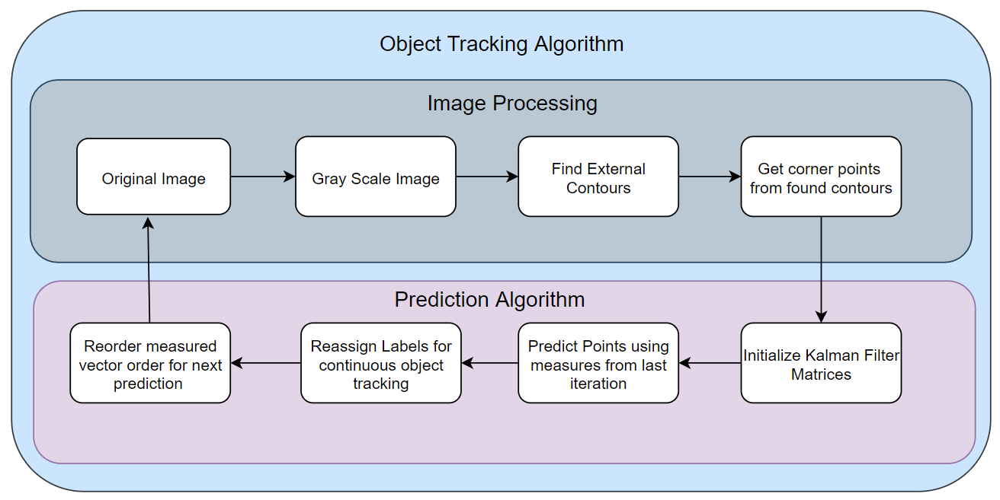
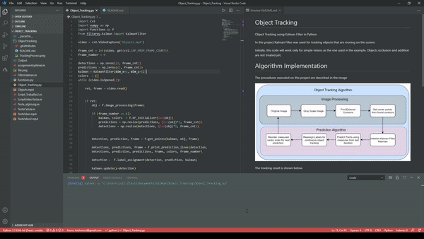

# Object Tracking
 Object Tracking using Kalman Filter in Python

In this project Kalman Filter was used for tracking objects that are moving on the screen. 

Initially, this code will work only for simple videos as the one used in the example.  Objects occlusion and addition are not treated yet.

# Algorithm Implementation

The procedures executed on this project are described in the image

The tracking result is shown below.

# Future Improvements
The following topics will be focused on future improvements:
1. Include object occlusion treatment.
2. Deal with objects leaving/entering the scene.
3. Track objects from a live video.
